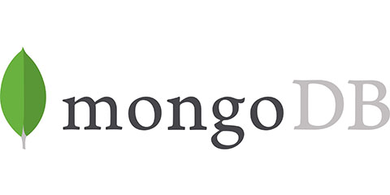

## 6.2 MongoDB


### 6.2.1 Beschreibung
MongoDB gehört zu den beliebtesten NoSQL-Vertretern. Der Name 'Mongo' wurde abgeleitet von 'humongous' (gigantisch). MongoDB ist eine skalierbare, hochperformante, schemafreie und dokumentenorientierte Open-Source-Datenbank, die durch ihre Features im Vergleich zu anderen NoSQL-Datenbanken besticht. Zudem stellt sie das Bindeglied zwischen klassischen relationalen Datenbanken und Key/Value-Stores her. Dokumente werden im im BSON-Format verwaltet. Eine integrierte Query Language ermöglicht einfache Abfragen, Replikationen und Sharding (Replikationen und Sharding ermöglicht die Verwendung vieler nicht so leistungsstarker Rechner). Zudem kann eine Vielzahl bekannter Programmiersprachen angebunden werden. Umfangreiche Abfragemöglichkeiten mit guter Skalierbarkeit und Performance gekoppelt schaffen eine Konkurrenz zu den klassichen RDMBS (Relational Database Management System). MongoDB kann in virtuellen Umgebungen, bei Cloud Computing und in den gängigen Betriebsystemen Linux, Mac OS und Windows eingesezt werden. Das Datenbanksystem verfügt zudem über einen kommerziellen Support [1,2].

MongoDB zeichnet sich vor allem durch ein flexibles Datenbank Schema, welches dynamsich angepasst werden kann, aus. Die Daten werden in JSON-ähnlichen Dokumenten gespeichert, wodurch die Felder in den einzelnen Dokumenten variieren und die Datenstrukturen sich über die Dauer verändern. Durch Ad-hoc-Abfrgen, Indizierung und Echtzeitaggregation wird der Zugriff und die Analyse der Daten vereinfacht [3]. 
Ein großes Manko von MongoDB stellt die Sicherheit beim Zugriff dar, da dieser nur mit Einstellung der IP-Tables erfolgt. Aus diesem Grund sind Tranksaktionen und Query-Operationen im Gegensatz zu einem RDBMS nicht im vollen Umfang möglich [1]. 


### 6.2.2 Datenbankaufbau

MongoDB hält die Dokumente temporär im Speicher und übermittelt sie im BSON-Format an den Client Driver. Der Client Driver muss dazu mit dem BSON-Format umgehen können. Anders als bei relationalen Datenbanken gliedert sich die Struktur der Daten in MongoDB in beliebig viele Collections, in denen sich wiederum beliebig viele Dokumente befinden. Ein Beispiel hierfür sieht wie folgt aus:

| Datenbankname: lectures  				|
|-------------------------------------------------------|
| Collection tutors   |
| ```{_id:1, name:"Maier"} {_id:2, name:"Müller"} ``` |
| Colection lectures 						 | 
| ```{_id:1; turor_id:1,  lecture:"Quantencomputer"} {_id:1; turor_id:1,  lecture:"Mathematik 1"}``` | 


#### 6.2.2.1 Datenbank
Mehrere Datenbanken nebeneinander sind beim MongoDB Server zulässig. Jeder dieser Datenbanken wird einzeln behandelt und kann spezifisch gestaltet werden. Der Bestandteil einer Datenbank sind Datafiles in dem die Dokumente im BSON-Format vorliegen (Datenbankname.0, Datenbankname.1") und Namespace-Files ("Datenbankname.ns"). Eine Liste von Collections und Metadaten sind innerhalb des Namespace-Files zu finden [2].

#### 6.2.2.2 Collection
Collections lassen sich mit den Tabellen eines RDBMS vergleichen. Jedoch werden sie anders als die Tabellen erst erstellt sobald sie benötigt werden. Erst wenn ein Dokument in eine neue Collection eingefügt werden soll, wird diese erstellt. Eine Collection sollte mit einem einzelnen Buchstaben oder einem Unterstich beginngen. Das "$"-Zeichen sowie "system." sind bereits als Präfix für die Abfrageoperatoren sowie als Namespace-Präfix für die Metainformationen der jeweiligen Datenbank reserviert und dürfen deshalb nicht in der Benamung von Collections verwendet werden [2].  

Eine spezielle Form der Collections ist die **Capped Collection**, da diese in ihrer Größe beschränkt werden kann. Hierbei wird nach dem First-In-First-Out-Prinzip gearbeitet. Der Zeitpunkt indem erstmalig etwas zum Dokument hinzugefügt wurde bestimmt das Alter. Wird die vordefinierte Größe einer Capped-Collection erreicht, wird sobald etwas neues eingefügt wird das älteste Dokument automatisch gelöscht. Capped Collection bringen zwei Beschränkungen mit sich:

* nur bei unveränderter Größe können bestehende Dokumente verändert werden 
* bestehende Dokumente können nicht gelöscht werden

Aufgrund der hohen Performance beim Einfügen neuer Dokuemnte eignen sich Capped Collection vor allem für Anwendungszwecke mit einer hohen Insert-Rate  [1].

#### 6.2.2.3 Dokumente

Die einzelnen Dokumente stellen das pendant zu den Zeilen (Row) der relationalen Datenbanken dar. Die Anzahl an Feldern (Key) mit einem Wert (Value) ist beliebig. Anders als bei Tupeln gibt es keine vordefinierte Reihenfolge mit fest definierten Datentypen, sondern es werden assoziative Arrays verwendet. Wie auch in anderen Sprachen kann man innerhalb von MongoDB Objekte in Array und Objekte verschachteln. Die Key in diesen Arrays sind Zeichenketten. Wie auch für die Collections gibt es Konventionen für die Bennenung. So darf weder ein "." enthalten sein, nohc das Zeichen "$" am Anfang eines Schlüssels stehen. Abgespeichert und übertragen werden Dokumente im BSON-Format [1,2].


MongoDB unterstützt die folgenden Datentypen:

* Standard Datentypen: Integer, Float, String, Array, Boolean
* Date
* Embedded-Doc
* DBRef
* ObjectId

#### 6.2.2.4 Referenzen
Anders wie bei SQL-Datenbanken bietet MongoDB keine Joins an. Somit kommt da Prinzip der Foreign Keys, die aus relationalen Datenbanken bekannt sind, nicht zum Einsatz. Die Daten sollten möglichst alle in einem Dokument abgebildet werden. Aus diesem Grund wird die Referenzierung von Dokumenten untereinander eingesetzt [4]. MongoDB bietet drei Arten der Referenzierung. Zum einen EmbeddedDoc (serverseitiges referenzieren), bei denen ein Dokument auf ein anderes einzelnes Dokument verweist. Des Weiteren können mehrere Dokumente durch ObjectID auf ein Dokument in der gleichen Collection verweisen. Die dritte Möglichkeit steleln DBRef (Clientseitiges referenzieren) dar. Hierbei verweisen mehrere Dokumente auf ein Dokument in einer anderen Collection. Dadurch vermeidet DBRef doppelte Datensätze [2].


### 6.2.3 Skalierung
Die automatische, horizontale Skalierung von MongoDB macht es möglich, dass nur mit einem Server gestartet werden kann und über die Zeit hinweg diesen zu einem Cluster auszuweiten. Die Architektur der horizontalen Skalierung wird bei MongoDB mit dem gängigen Begriff Sharding bezeichnet. Diese Architektur ist dabei stark an die Architektur von Googles BigTable und damit auch HBase angelehnt. Es wird nach dem Master-N-Slaves-Prinzip gearbeitet. Auf der Ebene der Collections werden die Daten horizontal verteilt. Eine Collection erfordert eine Kombination von einem oder mehreren Schlüsseln, den sog. Sharding-Keys. Diese werden dann für die Aufteilung der Daten verwendet und die Dokumente werden anhand dieser geordnet und gespeichert. Die Schlüsselkombinationen ermöglichen es, dass nah beieinanderliegende Dokumente auf einem Server gespeichert werden. Bei der Administration muss leidiglich darauf geachtet werden, das eine geeignete Schlüsselkomibnation für das Sharding festgelegt wird.
Collections werden in Pakete mit konfigurierbarer maximaler Größe, sogenannte Chunks aufgeteilt. Chunks sind Bestandteile einer bestimmten Collection, wobei für sie ein bestimmter Abschnitt der Schlüsselkombination definiert ist. Erreicht ein Chunk die maximale Größe, dann erfolgt automatisch eine Aufteilung.
Die Chunks werden auf Serven, sog. Shards gespeichert. Diese wiederum bestehen aus einer oder mehreren Datenbanken. Die Verteilung der Chunks auf die Shards erfolgt automatisch. Es wird jedoch versucht das alle Shards die gleiche Größe aufweisen. Enthält ein Shard zu viele Chunks, so werden diese automatisch auf andere Shards verteilt.
Die allgemeinen Informationen über die Verteilung der Chunks innerhalb der Shards liegen auf sogenannten Config-Servern. Diese sind für die Verwaltung der Metadaten eines Clusters zuständig und enthalten eine Verteilungsübersicht der Chunks. Mittels mehrerer Routing-Server geschieht das Routing von Client-Anfragen an den Shard.


### 6.2.4 Replikation
### 6.2.5 Sicherheit
### 6.2.6 Bewertung


<hr>
[1] Edlich <br>
[2] http://wikis.gm.fh-koeln.de/wiki_db/index.php?n=Datenbanken.MongoDB <br>
[3] https://www.mongodb.com/de/what-is-mongodb <br>
[4] Kindle Buch 

<hr>